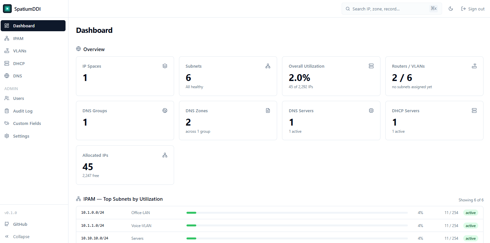
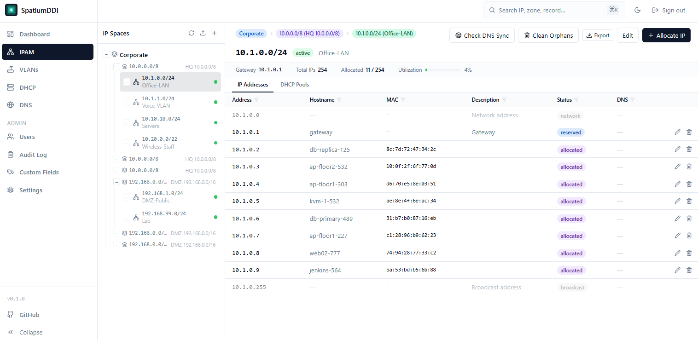
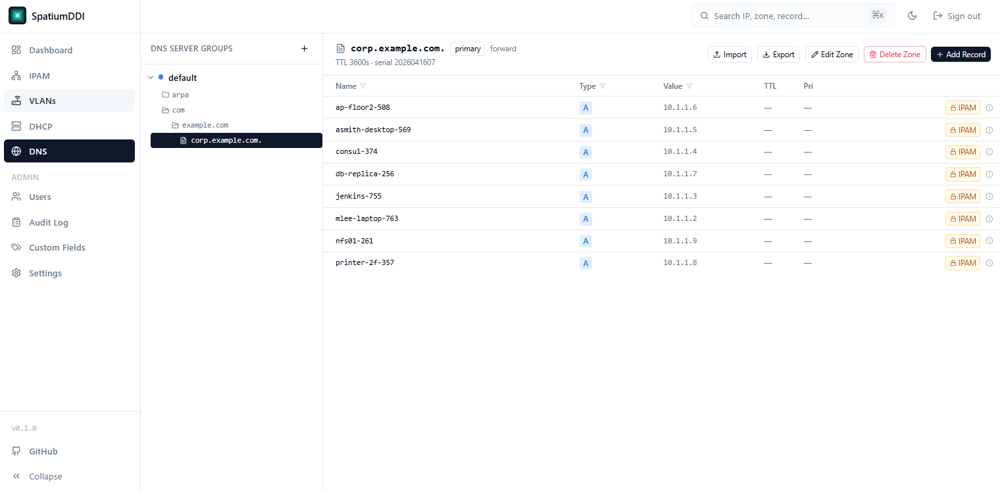
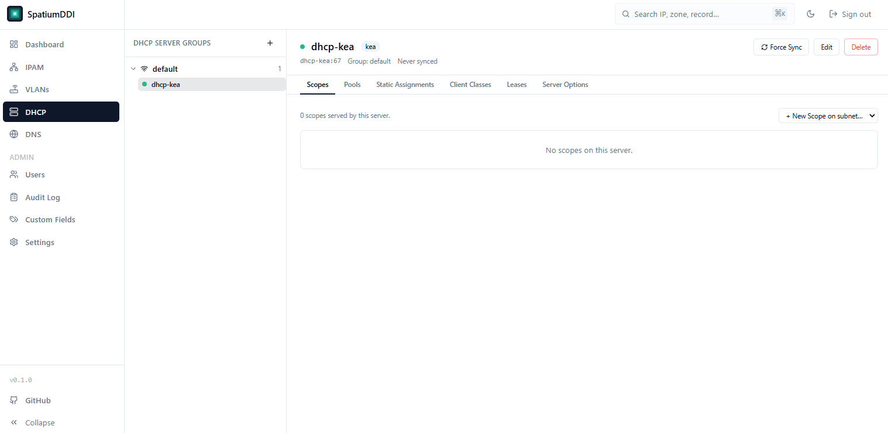
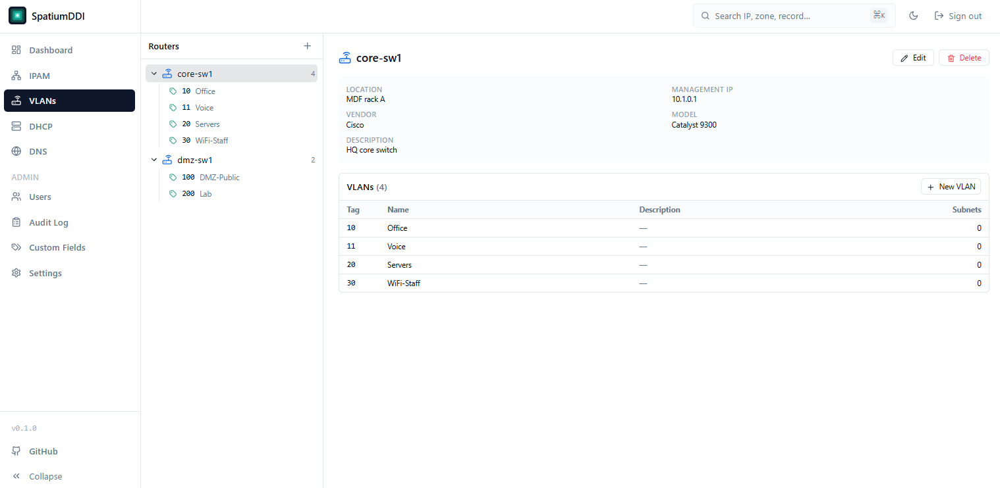
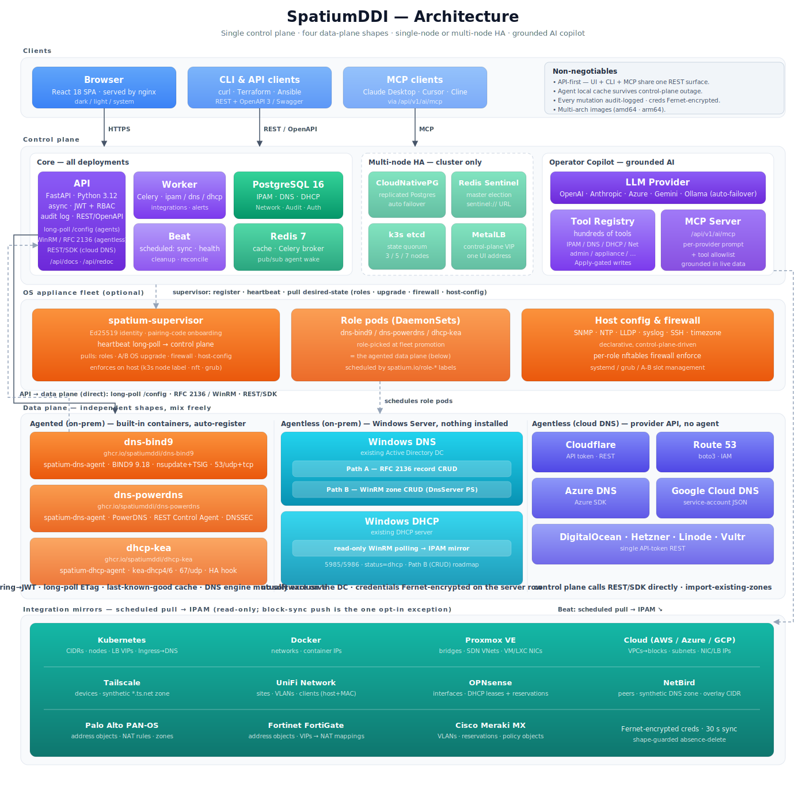

<p align="center">
  
</p>

<h1 align="center">SpatiumDDI</h1>

<p align="center">
  <strong>Open-source DDI — DNS, DHCP, and IP Address Management</strong><br/>
  Manage your entire network address space from one unified platform.
</p>

<p align="center">
  <a href="https://github.com/spatiumddi/spatiumddi/blob/main/LICENSE"></a>
  <a href="https://github.com/spatiumddi/spatiumddi/issues"></a>
  <a href="https://spatiumddi.github.io"></a>
  
  
  
</p>

---

> ⚠️ **Alpha software.** SpatiumDDI is under active development and has not yet been battle-tested in production. Expect rough edges, breaking schema changes between releases (Phase 1), and features listed in the roadmap that are still in flight. Run it in a lab, file bugs, and please don't put it in front of DHCP clients you care about until Phase 2 is complete. Early adopter feedback is very welcome — open an issue or start a discussion on GitHub.

---

## What is SpatiumDDI?

SpatiumDDI is a production-grade, open-source **DDI platform** — DNS, DHCP, and IP Address Management — built for teams that need real control over their network infrastructure without paying enterprise licensing fees.

It is designed as a modern alternative to commercial DDI platforms like EfficientIP and Infoblox. Unlike most open-source alternatives, SpatiumDDI **manages and runs its own DNS/DHCP containers** — it is not a pretty front end over an external BIND9. The control plane is the source of truth; the service containers auto-register, pull their config, and keep serving even if the control plane goes down.

- 🗂 **Hierarchical IP management** — spaces, blocks, subnets, addresses in a visual tree
- 🌐 **Built-in DNS server** — BIND9 container that auto-registers and syncs via RFC 2136
- 🔄 **DHCP server management** — Kea container + agent with lease tracking (Phase 2); ISC DHCP + HA hook pending
- 🔒 **Granular permissions** — delegate IP ranges and zones via LDAP / OIDC / SAML
- 📋 **Full audit trail** — every mutation logged, append-only, viewable in the UI
- 🚀 **Flexible deployment** — Docker Compose, Kubernetes (Helm), bare metal, or OS appliance

---

## Screenshots

_Click any image to open the full-size version._

| [Dashboard](docs/assets/screenshots/dashboard.png) | [IPAM](docs/assets/screenshots/ipam.png) |
| :---: | :---: |
| [](docs/assets/screenshots/dashboard.png) | [](docs/assets/screenshots/ipam.png) |
| Utilisation, VLAN, DNS &amp; DHCP status at a glance | Hierarchical space / block / subnet tree with per-IP DNS sync |

| [DNS](docs/assets/screenshots/dns.png) | [DHCP](docs/assets/screenshots/dhcp.png) | [VLANs](docs/assets/screenshots/vlans.png) |
| :---: | :---: | :---: |
| [](docs/assets/screenshots/dns.png) | [](docs/assets/screenshots/dhcp.png) | [](docs/assets/screenshots/vlans.png) |
| Zones, records, server groups | Scopes, pools, static reservations | Routers &amp; VLANs linked to subnets |

---

## Architecture

<p align="center">
  
</p>

**Control plane** — FastAPI + PostgreSQL + Redis + Celery. Single source of truth for everything (IPAM tree, DNS records, auth, audit log). Exposes a REST API; the web UI and any Terraform / Ansible / CLI integration all speak the same API.

**Data plane** — one container per DNS server (Phase 2 adds DHCP). Each container bakes in a sidecar `spatium-dns-agent` that:

1. **Bootstraps** on first start using a shared `DNS_AGENT_KEY` (PSK) → gets a per-server rotating JWT.
2. **Long-polls** `/api/v1/dns/agents/config` with ETag. Server holds the connection until config changes or the timer expires.
3. **Caches** the last-known-good config bundle on disk. If the control plane is unreachable, named keeps serving.
4. **Drains record ops** over loopback via `nsupdate` + TSIG (RFC 2136). Structural changes reload named; record changes do not.

The control-plane driver abstraction emits a backend-neutral config bundle. BIND9 is the only supported backend in v1.

**Tech stack**: Python 3.12 · FastAPI · SQLAlchemy 2.x (async) · PostgreSQL 16 · Redis 7 · Celery · React 18 · TypeScript · Tailwind · shadcn/ui · Docker · Kubernetes + Helm

---

## Getting Started

> ⚠️ SpatiumDDI is pre-alpha. Commands and APIs may shift before the first tagged release.

### Quick start with Docker Compose

```bash
git clone https://github.com/spatiumddi/spatiumddi.git
cd spatiumddi
cp .env.example .env
# Required env vars in .env:
#   POSTGRES_PASSWORD=<set this>
#   SECRET_KEY=$(openssl rand -hex 32)
#   DNS_AGENT_KEY=$(openssl rand -hex 32)   # needed if running the DNS container
docker compose build
docker compose run --rm migrate
docker compose up -d
```

Open `http://localhost:8077` and log in with `admin` / `admin` (you're forced to change the password on first login).

### Running the built-in BIND9 / Kea containers

The managed-service containers ship under Compose profiles — opt in when you want them:

```bash
docker compose --profile dns up -d                 # DNS only
docker compose --profile dns --profile dhcp up -d  # DNS + DHCP
```

Or set `COMPOSE_PROFILES=dns,dhcp` in your `.env` so plain `docker compose up -d` enables both automatically.

That starts `dns-bind9` bound to host port `5353` (udp + tcp). The agent registers with the control plane automatically using `DNS_AGENT_KEY` from your `.env` and appears in the UI under **DNS → Server Groups → default**.

Create a zone + record in the UI, then verify with `dig`:

```bash
dig @127.0.0.1 -p 5353 <your-record>.<your-zone> A +short
dig @127.0.0.1 -p 5353 -x <your-ip> +short    # reverse (PTR)
```

Record changes propagate to BIND9 via RFC 2136 — typically sub-second, no daemon restart. Zone / ACL / view changes trigger a config reload.

**Production**: point the agent at your real control plane, expose `53/udp` + `53/tcp`, and run one container per DNS server you want in the cluster. All servers in a group share the same TSIG key for dynamic updates.

### API & interactive docs

The FastAPI backend auto-generates OpenAPI / Swagger:

| Path | What |
|---|---|
| `http://localhost:8077/api/docs` | Swagger UI — try endpoints directly from the browser |
| `http://localhost:8077/api/redoc` | ReDoc — cleaner reference layout |
| `http://localhost:8077/api/openapi.json` | Raw OpenAPI 3 spec (for code generators) |

Every UI action is a REST call, so anything you do in the UI you can do via `curl`, Terraform, or your own client. Log in to the UI first to obtain a bearer token, then use `Authorization: Bearer <token>`.

### Reset the admin password

```bash
docker compose exec api python - <<'EOF'
import asyncio
from sqlalchemy import update
from app.core.security import hash_password
from app.db import AsyncSessionLocal
from app.models.auth import User

async def reset():
    async with AsyncSessionLocal() as db:
        await db.execute(update(User).where(User.username == "admin")
            .values(hashed_password=hash_password("NewPass!"), force_password_change=True))
        await db.commit()

asyncio.run(reset())
EOF
```

### Requirements

- Docker 24+ and Docker Compose v2, **or**
- Kubernetes 1.27+ with Helm 3, **or**
- Ubuntu 22.04 / Debian 12 / Alpine 3.20+ for bare metal

---

## Deployment Options

| Method | Use case | Status |
|---|---|---|
| **Docker Compose** | Dev, small single-host production | ✅ Supported |
| **Kubernetes + Helm** | Multi-node production, scalable | 🔄 Chart scaffolded (`charts/spatium-dns`) |
| **Bare metal / VM (Ansible)** | On-prem without containers | 📋 Planned |
| **OS Appliance (ISO / qcow2)** | Air-gapped, zero-dependency | 📋 Planned |

---

## Documentation

Full docs at **[spatiumddi.github.io](https://spatiumddi.github.io)** (coming soon).

| Document | Description |
|---|---|
| [IPAM Features](docs/features/IPAM.md) | IP space, block, subnet, address management |
| [DHCP Features](docs/features/DHCP.md) | DHCP server management (Phase 2) |
| [DNS Features](docs/features/DNS.md) | DNS zones, views, server groups, blocking lists |
| [Auth & Permissions](docs/features/AUTH.md) | LDAP, OIDC, roles, scoped permissions |
| [System Admin](docs/features/SYSTEM_ADMIN.md) | Health dashboard, backup, notifications |
| [Observability](docs/OBSERVABILITY.md) | Logging, metrics, alerting |
| [DNS Agent Design](docs/deployment/DNS_AGENT.md) | Agent protocol, auto-registration, config sync |
| [DNS Driver Spec](docs/drivers/DNS_DRIVERS.md) | BIND9 driver internals |
| [Appliance Deployment](docs/deployment/APPLIANCE.md) | OS image build and licensing |

---

## Project Status

| Phase | Focus | Status |
|---|---|---|
| Phase 1 | Core IPAM, auth, user management, audit log, Docker Compose | 🔄 In progress |
| Phase 2 | DHCP (Kea + ISC), DNS (BIND9), DDNS, zone/subnet tree UI | 🔄 DNS + Kea DHCP landed; ISC DHCP + DDNS pending |
| Phase 3 | DNS views, server groups, blocking lists, VLAN/VXLAN, system admin | 🔄 DNS features landed |
| Phase 4 | OS appliance, Terraform provider, SAML, backup/restore | 📋 Planned |
| Phase 5 | Multi-tenancy, IP request workflows, advanced reporting | 📋 Planned |

See [CLAUDE.md](CLAUDE.md) for the authoritative feature list.

---

## Contributing

Contributions are welcome.

- Read [CONTRIBUTING.md](CONTRIBUTING.md) before opening a PR
- Good first tasks are tagged on the [issue tracker](https://github.com/spatiumddi/spatiumddi/issues)
- Design discussion happens in [GitHub Discussions](https://github.com/spatiumddi/spatiumddi/discussions)

---

## License

Released under the [Apache 2.0 License](LICENSE).

Bundled components (BIND9, ISC Kea) are distributed under their own licenses. See [NOTICE](NOTICE) for the full list.

---

<p align="center">
  Built with ❤️ by the SpatiumDDI community · <a href="https://spatiumddi.github.io">spatiumddi.github.io</a>
</p>
