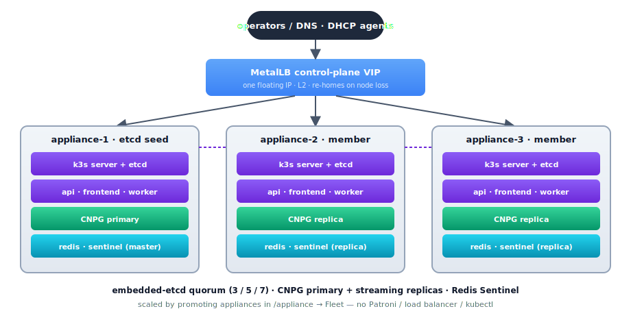

# Production Deployment Topologies

> SpatiumDDI is designed to scale from a single homelab VM all the way to a
> distributed multi-region deployment with the control plane in the cloud
> and DNS/DHCP agents running on-prem. This guide walks through seven
> reference topologies and shows which knobs each one flexes — including
> the self-contained **multi-node appliance HA** path (Topology 7), where
> you promote OS appliances into a 3/5/7-node control-plane cluster from
> the web UI with no Patroni / Helm / kubectl to operate.

For the per-platform install steps, see:

- [`DOCKER.md`](DOCKER.md) — Docker Compose deployment recipes
- [`../../k8s/README.md`](../../k8s/README.md) — Kubernetes manifests + Helm chart
- [`DNS_AGENT.md`](DNS_AGENT.md) — DNS-agent protocol details
- [`APPLIANCE.md`](APPLIANCE.md) — OS appliance image
- [`WINDOWS.md`](WINDOWS.md) — Windows Server-side checklist (WinRM / DnsAdmins / DHCP Users)

---

## What needs to scale, and how

| Concern | Where it lives | How it scales |
|---|---|---|
| **Control plane API** (`api`) | FastAPI process | Stateless — run N copies behind a load balancer |
| **Async work** (`worker`) | Celery worker process | N copies, sharded by queue (`ipam`, `dns`, `dhcp`, `default`) |
| **Scheduler** (`beat`) | Celery beat | Exactly **one** instance — not horizontally scalable. Run two with leader-election (`celery-beat-leader`) only if you need HA |
| **Frontend** (`frontend`) | nginx + static Vite build | Stateless — horizontally scalable, often co-located with the API behind the same LB |
| **PostgreSQL** | Stateful, primary write source | Patroni (bare-metal/VM), CloudNativePG (K8s + the OS appliance) for HA. On the appliance, CNPG instances scale automatically with the promoted control-plane member count (#272). Read replicas optional — SpatiumDDI doesn't currently route reads to replicas |
| **Redis** | Cache + Celery broker + factory-reset lock | Sentinel for HA; single-node fine until you need >1 worker host. On the appliance, Sentinel replicas scale with the member count |
| **Appliance control plane** (k3s) | Single-binary k3s on each OS-appliance node | Promote Appliances in the Fleet UI → embedded-etcd quorum (3/5/7) + a MetalLB control-plane VIP. Self-contained — no external DCS / load balancer to run (Topology 7) |
| **DNS agents** (BIND9 + sidecar) | Per DNS server | One agent per DNS server. 2-node HA via primary/secondary or split-horizon view |
| **DHCP agents** (Kea + sidecar) | Per DHCP server | One agent per DHCP server. Group-centric Kea HA across 2+ peers |
| **Backup destinations** | External (S3/SCP/Azure/SMB/FTP/GCS/WebDAV) | Out-of-band — operator's responsibility. SpatiumDDI just writes archives there |

The control plane's blast radius is roughly **the API container's writable
layer** (which is empty when scheduled targets push to a remote
destination). The agents survive control-plane outages because they
long-poll the `/config` endpoint with an ETag and cache the last-known-good
config locally — non-negotiable #5 in `CLAUDE.md`.

---

## Topology 1 — Single VM (dev / homelab)

Everything in one Docker Compose stack. This is the default
`make up` target and what most homelab installs run.

<p align="center">
  
</p>

**Pros:** simplest to run, fastest to bring up, single backup unit.
**Cons:** every service shares one host. A noisy neighbor (e.g. a DHCP
storm filling Kea's lease store) can degrade the API. No HA.

**Sizing:** 4 vCPU / 8 GB / 50 GB SSD comfortably handles up to
~5,000 IP addresses across ~50 subnets, ~50 DNS zones, and a
modest DHCP scope set. Past that, split off the agents (Topology 2).

---

## Topology 2 — Control plane + separate DNS/DHCP appliances

The shape most production deployments reach for first. Control plane
on its own VM; DNS and DHCP agents on dedicated, network-edge
machines. Agents long-poll the control plane's API.

<p align="center">
  
</p>

**What this gets you:**

- Control plane outages don't take DNS/DHCP down. The agents serve
  zones / leases from the local cache until the API is reachable
  again.
- DNS and DHCP can sit at the network edge with their own firewall
  rules, while the API can be inside a corp network behind LDAP /
  OIDC.
- Each appliance can be sized for its workload — DNS query volume vs
  DHCP lease churn typically don't peak at the same time of day.

**The two compose files:**

```bash
# On vm-dns (BIND9 — pick `agent-dns-powerdns.yml` instead for PowerDNS):
export CONTROL_PLANE_URL=https://spatium-cp.corp.local
export DNS_AGENT_KEY=<paste-from-Settings→Security→Agent bootstrap keys>
export DNS_HOSTNAME=vm-dns.corp.local
docker compose -f docker-compose.agent-dns-bind9.yml up -d

# On vm-dhcp:
export SPATIUM_API_URL=https://spatium-cp.corp.local
export SPATIUM_AGENT_KEY=<paste-from-Settings→Security→Agent bootstrap keys>
export DHCP_HOSTNAME=vm-dhcp.corp.local
docker compose -f docker-compose.agent-dhcp.yml up -d
```

The agent registers with the control plane on first boot, exchanges
its PSK for a rotating JWT, then long-polls forever. See
[`DNS_AGENT.md`](DNS_AGENT.md) for the protocol.

> **OS-appliance agents take a different path.** The compose +
> `SPATIUM_AGENT_KEY` recipe above is the raw-Docker route. If your
> agents are SpatiumDDI OS appliances, install the **Appliance** role
> and onboard them with an **8-digit pairing code** from `/appliance →
> Pairing` — no hex key to copy. The agent's supervisor registers, the
> operator approves it on `/appliance → Fleet`, and roles are assigned
> from the UI. See the README's
> ["Joining DNS / DHCP agents"](../../README.md#joining-dns--dhcp-agents)
> section + [`APPLIANCE.md`](APPLIANCE.md).

---

## Topology 3 — DNS + DHCP HA pairs

Production-grade availability. Multiple DNS servers in a server group
(primary + secondary, or split-horizon views), Kea DHCP HA across
two peers. Each DNS or DHCP host is its own VM.

<p align="center">
  
</p>

Configured via the UI:

- **DNS Server Group** — list `vm-dns-01` and `vm-dns-02` as members of one
  group. Records render to both. SpatiumDDI watches per-server zone
  serials so you can spot a slave that hasn't transferred (zone-state pill
  on the zone page).
- **DHCP Server Group** with HA mode = `hot-standby` (or `load-balancing`
  for higher throughput). Set `ha_peer_url` on each Kea server to the
  other peer's reachable URL. The `2026.04.21-2` release shipped the
  three-wave HA story including peer-IP self-healing — DNS changes that
  rename a peer no longer break the HA pair.

The DNS and DHCP agents continue to long-poll the control plane; if
the API is unreachable, both sides serve from cache and Kea HA
continues operating against its peer regardless of control-plane state.

---

## Topology 4 — HA control plane (Patroni + Redis Sentinel)

Removes the control plane as a single point of failure. Two or more
API hosts behind a load balancer; PostgreSQL via Patroni (3 nodes is
the standard quorum); Redis via Sentinel. Beat stays single-instance
(see the table at the top — it's not horizontally scalable without
leader-election).

> **Running the OS appliance? See [Topology 7](#topology-7--appliance-multi-node-control-plane-ha-272)
> instead** — it gives you this same HA shape self-contained (bundled
> CNPG + Redis Sentinel + embedded etcd + a MetalLB VIP), scaled by
> promoting appliances in the Fleet UI with no Patroni / LB / kubectl to
> run. Topology 4 is for hand-rolled bare-metal / Docker control planes.

<p align="center">
  
</p>

DNS / DHCP agents per Topology 2 / 3 above, pointing at the LB URL.

**What's in the repo for this:**

- `k8s/ha/postgres-cluster.yaml` — CloudNativePG manifest (K8s analogue of
  Patroni). Three-node primary + 2 replicas with auto-failover.
- `k8s/ha/redis-sentinel.yaml` — Redis Sentinel manifest.
- `k8s/ha/postgres-docker-compose.yaml` — Patroni reference for Docker Compose
  (use this if you're not on K8s yet but want a real HA database).
- `charts/spatiumddi` — umbrella Helm chart that selects the HA shapes
  via `postgresql.kind=cnpg` / `redis.kind=sentinel`.

The API is stateless — no in-memory session state — so a request
hitting either api host gets the same answer. Sticky LB only matters
for the SSE streams (chat orchestrator, scheduled-target-archives
list); the LB just needs to keep the connection on the same backend
once it's open.

**Beat HA caveat.** Celery beat is intentionally single-instance.
Running two beats without leader-election double-fires every
scheduled task. If you need beat HA, use `celery-beat-leader` (Redis-
based leader election) and configure each beat instance with the
same lock key. We don't ship that today — for most installs the
"recreate beat from a healthy backup" recovery path is fine.

---

## Topology 5 — Hybrid cloud: control plane in cloud, agents on-prem

Control plane runs in your cloud account (AWS / Azure / GCP / Hetzner /
DigitalOcean / Vultr — any provider). DNS and DHCP agents stay
on-prem because they're network-path dependencies — DNS recursion has
to terminate close to the queriers, DHCP has to be on the same broadcast
domain as its clients.

<p align="center">
  
</p>

**Why this works:**

1. The control plane's only outbound dependency is the database. Cloud
   provides better postgres HA than most on-prem racks.
2. The agents don't need a persistent control-plane connection. They
   long-poll over HTTPS; the connection can drop for hours and they
   keep serving from cache.
3. Backup destinations don't have to be in the same region. A cloud
   control plane can write nightly archives to an on-prem SCP target
   (or vice versa). See the SCP / S3 / Azure / SMB / FTP / GCS / WebDAV
   driver matrix in `docs/features/SYSTEM_ADMIN.md` §2.9.

**Caveats:**

- Latency. The web UI and `/api/v1/*` round-trips go cloud-to-corp.
  For a US team operating an EU control plane that's 80–150 ms per
  request — workable but noticeably slower than local. Pick a region
  near your operators.
- TLS certificate management for `spatium.example.com` belongs to the
  cloud-side LB. Use ACME (the embedded ACME / Let's Encrypt client
  shipped in #438) or bring-your-own.
- Audit-forward / SMTP / webhook events fire from the cloud-side
  control plane. Make sure your network policy lets them out — most
  setups don't have to think about this.

**Cloud variants of each component:**

| Component | AWS | Azure | GCP | Comment |
|---|---|---|---|---|
| API + worker + beat | EC2 + ALB / ECS Fargate / EKS | VM Scale Set + App Gateway / AKS | GCE + L7 LB / GKE | Stateless; treat as cattle |
| Postgres | RDS (Multi-AZ) | Azure Database for PostgreSQL | Cloud SQL | All three honor `postgresql+asyncpg://` URLs |
| Redis | ElastiCache (cluster mode) | Azure Cache for Redis | Memorystore | Sentinel not required when the managed service does failover |
| Backup destination | S3 native | Azure Blob native | GCS native | All three driver kinds ship in the registry |
| Frontend (static) | CloudFront + S3 | Azure CDN + Blob | Cloud CDN + GCS | Or just serve from the same LB |

---

## Topology 6 — Kubernetes (single chart, multi-node)

The Kubernetes flavour of Topology 4. The umbrella Helm chart
(`charts/spatiumddi`) ships every component — api / worker / beat /
frontend / migrate / Postgres + Redis subcharts (or external
endpoints) / optional DNS+DHCP agent StatefulSets.

<p align="center">
  
</p>

The chart's relevant values:

```yaml
postgresql.kind: cnpg           # HA Postgres via the CloudNativePG operator
redis.kind: sentinel            # HA Redis via the in-chart sentinel shape
api.replicas: 3
worker.replicas: 4
worker.netRawCapability: true   # for passive DHCP fingerprinting
dnsAgents.enabled: true         # spawns the bind9 StatefulSet
dhcpAgents.enabled: true        # spawns the kea StatefulSet (group-centric HA)
```

Beat is always a single-replica singleton — there's no toggle for it.

See [`../../k8s/README.md`](../../k8s/README.md) for the Helm-vs-raw-manifest
walkthrough, the RWX PVC overlay needed for `local_volume` backup
targets, and the upgrade-flow recipe.

---

## Topology 7 — Appliance multi-node control-plane HA (#272)

The self-contained version of Topology 4, built **without touching
Patroni, Helm values, or kubectl**. Every SpatiumDDI OS appliance is a
single-node [k3s](https://k3s.io/) cluster; you scale the control plane
to 3 / 5 / 7 nodes by **promoting** appliances from the web UI
(`/appliance → Fleet → Manage control plane cluster…`). This is the
recommended HA path for operators who installed from the ISO.

<p align="center">
  
</p>

**How it differs from Topology 4 / 6:**

- **No external Patroni / CloudNativePG to operate.** The appliance
  bundles the CNPG operator; promoting a node scales the `Cluster` CR's
  instance count automatically (primary + streaming replicas + failover).
- **Embedded etcd, not an external DCS.** k3s runs etcd in-process on
  each server node. **Odd member counts only** (1 → 3 → 5 → 7); the API
  refuses a batch that would land on an even total. Promotion does a full
  k3s cluster-identity reset + rejoin of the seed's etcd (handled by the
  supervisor's host-side `spatium-cluster-join` runner — backed up +
  guardrailed).
- **One floating VIP, set in the UI.** A bundled MetalLB (L2) hands the
  frontend Service a control-plane VIP you pick in `Appliance → Network &
  Host`. Point DNS/DHCP agents + operator browsers at the VIP, not a
  single node IP — an agent pinned to one node's address loses its
  control plane whenever that node is down. (Control-plane *cluster
  members* need no such care: their supervisor heartbeats the in-cluster
  API Service automatically.) The self-signed Web UI cert auto-grows its
  SANs to cover every member + the VIP (an uploaded cert is never
  touched).
- **Singletons handled by the chart** — 1-replica `Recreate` beat with
  fast reschedule tolerations + a migrate Job gating app pods on the
  alembic head. No `celery-beat-leader` to run.
- **Control-plane workloads stay on control-plane nodes** via a per-role
  node label, so promoting a DNS-only appliance never schedules Postgres
  onto it.

**Bring-up:**

1. Install the first appliance (ISO, **Control plane** role) — that's
   the etcd seed + a working one-node control plane.
2. Install two more appliances and pair them (Appliance role, or a
   second/third Control-plane install).
3. `/appliance → Fleet → Manage control plane cluster…` → select the two
   → promote. Within ~60 s: etcd quorum across 3, CNPG at 3 instances,
   Redis Sentinel 3-node, api/worker/frontend at 3 replicas.
4. `Appliance → Network & Host` → set a MetalLB pool + a control-plane
   VIP. The frontend moves onto the VIP; the cert auto-covers it. Point
   every off-cluster DNS/DHCP agent's control-plane URL at this VIP.

**Failure behaviour:** lose one of three nodes → etcd keeps quorum (2/3),
CNPG fails over to a replica, the MetalLB VIP re-homes to a surviving
node, the UI stays up on the same address. Bring the node back, or
replace it — operator-driven dead-node replacement is the Phase 9
follow-up tracked on [#272](https://github.com/spatiumddi/spatiumddi/issues/272).

**Demote / teardown:** demoting members in the Fleet UI reverses the
scale (the etcd seed can't be demoted; demoting to an even count is
refused). A control-plane node can't be **revoked** while it's a live
cluster member — demote it first.

**When to use Topology 4 / 6 instead:** you already run a managed Postgres
(RDS / Cloud SQL) or an existing Kubernetes platform, or you want
read-scale / cross-region shapes the appliance doesn't bundle. Topology 7
is the "I want HA without becoming a Postgres + Kubernetes operator"
answer. Full design + the live shake-out log live in
[issue #272](https://github.com/spatiumddi/spatiumddi/issues/272);
the appliance internals are in [`APPLIANCE.md`](APPLIANCE.md#control-plane-high-availability-272).

---

## PowerDNS-primary + BIND-secondary hybrid (driver crossover)

SpatiumDDI ships two authoritative DNS drivers: BIND9 (default) and PowerDNS. Each `DNSServerGroup` is single-driver — but **multiple groups, each on a different driver, can serve overlapping namespaces** via plain AXFR or RFC 9432 catalog zones. Two operator-relevant shapes:

**Shape A — PowerDNS-primary + BIND-secondary on the same zones.** PowerDNS handles writes (online DNSSEC signing, ALIAS records, LUA records); BIND fans the zones out to a battle-tested edge. Catalog-zone-driven AXFR keeps both drivers in sync because the producer-side catalog renderer emits identical wire bytes from either driver (issue #127 Phase 3d).

```
Operators ─→ SpatiumDDI control plane
                │
                ├── DNSServerGroup "internal-pdns" (driver=powerdns)
                │     ├── pdns1.corp  (primary, signs DNSSEC)
                │     └── pdns2.corp  (secondary)
                │
                └── DNSServerGroup "edge-bind"  (driver=bind9)
                      ├── bind1.edge  (catalog consumer of internal-pdns)
                      └── bind2.edge  (catalog consumer of internal-pdns)
```

Wire it up:

1. In `internal-pdns` set `catalog_zones_enabled=true` + `catalog_zone_name=catalog.example.com.`. The PowerDNS primary publishes the catalog zone alongside member zones via the agent's REST patch path.
2. In `edge-bind` set `catalog_zones_enabled=true` + `catalog_zone_name=catalog.example.com.` + a `transfer_source` AXFR pointer at the PowerDNS primary. BIND auto-consumes the catalog and provisions secondary zones for every member it advertises.
3. Operator changes land via the SpatiumDDI UI → write-through to PowerDNS REST → PowerDNS bumps zone serial → BIND notices via NOTIFY-then-IXFR.

**Shape B — Per-zone driver placement (not crossover).** Some zones live on PowerDNS (those with ALIAS / LUA / DNSSEC needs), some on BIND9 (those with first-class views or RPZ blocklists). Each zone is owned by exactly one group; the operator picks the right group at zone-create time. The Operator Copilot's `propose_create_dns_zone` tool accepts a `driver_hint` arg that picks a matching group automatically — `dnssec_enabled=true` requires `driver_hint=powerdns` and rejects against any group with no PowerDNS member.

The driver-feature gate (server-side, `_DRIVER_GATED_RECORD_TYPES` + `_DRIVER_GATED_OPERATIONS`) means a PowerDNS-only feature called against a BIND group returns 422 with a remediation message ("move the zone to a PowerDNS-only group"). Mixed-driver groups are also rejected — an "internal-pdns" group cannot have one PowerDNS plus one BIND9 server, by design.

---

## Migrating a BIND9 group to PowerDNS without DNS downtime

Replacing a BIND9 group with a PowerDNS group on the same zones is a four-step recipe. The IPAM ↔ DNS sync, RBAC, and DDNS pipeline don't change — only the driver underneath the zones.

**Pre-flight check.** Inventory zones with PowerDNS-incompatible features: classic views (PowerDNS does views via tags — no auto-translation today), RPZ blocklists (recursor-only, not authoritative). If any zone in the group uses these, leave that zone on BIND9 and only migrate the others. The control plane allows mixed installs precisely so you can split the unmigratable zones off into a separate group.

**1. Stand up the PowerDNS group alongside BIND9.** Deploy a PowerDNS agent (Compose `--profile dns-powerdns`, Helm `dnsAgents.servers[].flavor: powerdns`, or a standalone-VM `docker-compose.agent-dns-powerdns.yml`) and let it auto-register. In the SpatiumDDI UI, create a new `DNSServerGroup` with `driver=powerdns` and the registered server as its primary. Both groups are now live; the BIND group still serves all zones.

**2. Catalog-driven zone copy.** On the BIND group, set `catalog_zones_enabled=true` + a catalog zone name (`catalog.migration.local.`). On the PowerDNS group, set the same and point its `transfer_source` at the BIND primary. Wait one sync cycle (~60 s). Every member zone the BIND group advertises is now auto-provisioned as a secondary on PowerDNS via AXFR. Verify `dig +short SOA <zone> @<powerdns-pod>` matches the BIND primary's serial. **No record edits should land during this window** — schedule the migration for a low-write period.

**3. Promote PowerDNS to primary.** In the UI, edit each zone and switch its `group_id` to the PowerDNS group. The control plane: (a) write-through-PATCHes the zone to PowerDNS as primary, (b) drops the catalog secondary and creates a primary entry, (c) rebuilds the SOA. BIND can stay on the zone as a plain catalog secondary (read-only) for a soft cutover, or be removed entirely. DDNS / IPAM auto-sync continue uninterrupted because they target the zone by ID, not by driver.

**4. Sign zones (optional).** With the zones now on PowerDNS, signed zones are a single click — open the zone-edit modal, hit **Sign zone** in the DNSSEC card. PowerDNS generates KSK + ZSK (online signing), rectifies the zone, and the agent reports DS records back to the control plane. **Re-publish DS records to your registrar** — that's the only out-of-band step. The DNSSEC card has a per-DS copy-to-clipboard button. See [issue #127 Phase 3c](https://github.com/spatiumddi/spatiumddi/issues/127) for the full flow.

**Rollback recipe.** If something goes wrong between step 2 and step 3, the BIND group is still authoritative — flip the zones back via the UI. If something goes wrong after step 3, the catalog-driven secondary on BIND is still serving the last-known-good zone state; promote it back to primary by switching the zone's group back to BIND. The IPAM ↔ DNS reconciler will pick up any record drift on the next 60-s sync cycle and re-stamp the zone.

**Post-restore caveat for DNSSEC zones.** PowerDNS DNSSEC keys live on the agent's LMDB volume, not in the control-plane backup. A factory-reset + restore-from-backup that wipes the agent's volume regenerates keys and produces NEW DS records — which means a new round-trip to the registrar. The restore endpoint surfaces this as a `RestoreOutcomeResponse.warnings[]` advisory listing every signed zone; the BackupPage UI renders it as an amber callout. See [issue #127 Phase 4d](https://github.com/spatiumddi/spatiumddi/issues/127).

---

## Picking a topology

| You have... | Start with |
|---|---|
| A single homelab box, 3 people max using it | Topology 1 |
| One DC, network-edge appliances expected | Topology 2 |
| One DC, downtime-sensitive DNS or DHCP | Topology 3 |
| Hand-rolled bare-metal / Docker HA control plane | Topology 4 |
| Branch offices feeding back to a HQ control plane | Topology 5 |
| Anything K8s-native | Topology 6 |
| **HA control plane from the OS appliance, no Patroni/kubectl** | **Topology 7** |
| Need ALIAS / LUA / one-toggle DNSSEC | Add a PowerDNS group to any of the above |

You can move between topologies without re-installing. Going from
Topology 1 → 2 → 3 → 4 is purely additive: new VMs join the existing
control plane via the agent-key bootstrap. The database doesn't
move; you just point more agents at the same API URL with the
bootstrap key from **Settings → Security → Agent bootstrap keys**,
and each agent registers itself on first boot. On the OS appliance, the
1 → 3 → 5 control-plane scale (Topology 7) is likewise additive — you
**promote** more appliances from the Fleet UI, no reinstall and no
database move.

---

## Backup + factory-reset across topologies

Backup and factory-reset (issues #117 + #116) work the same
regardless of topology — they hit the API endpoints, which are
stateless. A few shape notes:

- **`local_volume` backup target** in Topology 1 is fine on the
  single host. In Topology 2+, it lives on the control-plane VM and
  isn't shared with anything; switch to S3 / SCP / Azure / GCS /
  SMB / FTP / WebDAV for distributed installs.
- **Restore** runs via `pg_restore` against the live Postgres. In
  Topology 4+ point this at the **primary** (Patroni HAProxy port
  5000, not the read-only port 5001). The api containers' SQLAlchemy
  pool gets disposed during restore, so transient 503s during the
  restore window are expected — see the `pool_pre_ping=True` +
  transient-DB handler in `app/db.py`.
- **Cross-install rewrap on restore** (issue #117 Phase 2) means
  cross-topology restores don't need the recovered `SECRET_KEY`
  copied to the destination's env. Restore "just works" between
  Topology 1 ↔ 4 even if their `SECRET_KEY` env vars differ.
- **Factory reset** (issue #116) is global per-install; it doesn't
  touch agents. Each agent re-bootstraps from its PSK after a
  reset that wiped the agent-key rows.

---

## Fleet firewall posture across topologies (#285)

The declarative fleet firewall (full operator story in the "Fleet firewall"
section of [`APPLIANCE.md`](APPLIANCE.md)) applies to the **appliance**
topologies (1, 2, 3, 7) — Docker-Compose / generic
K8s control planes (4, 5, 6) manage host firewalling with their own tooling.
It's dark by default (the `appliance.firewall` module + the `firewall_enabled`
master switch); when enabled, each node's drop-in is compiled server-side from
the fleet → role → appliance policy layers:

- **Single VM (1)** — one node carries every role; the merge opens 53 (DNS),
  67/68 (DHCP), the control-plane ports peer-scoped (here: just itself), and
  the mgmt floor. The all-CP-hardened enforcement gate trivially passes (one
  hardened node).
- **Control plane + separate DNS/DHCP appliances (2, 3)** — the DNS-only and
  DHCP-only worker appliances open only their role ports + the floor; etcd
  (2379/2380) + kubelet (10250) never open on a non-CP worker. The control
  node(s) open the control-plane ports scoped to the cluster-peer CIDR set.
- **Appliance multi-node CP HA (7)** — every CP member opens etcd/kubelet +
  MetalLB memberlist (7946) scoped to the *peer* CIDRs (never LAN-wide; the
  #285 fix), and 6443 to peers ∪ pod ∪ service ∪ kubeapi-expose. The
  peer-drift cross-check (warn-only) flags a member whose peer entry hasn't
  propagated, or a left member's stale /32.

### Air-gapped / manual join under enforcement

A *joining* k3s node must reach the seed's apiserver on **6443 before** the
supervisor can render its own peer-scoped drop-in (a bootstrap chicken-and-egg).
The appliance keeps 6443 LAN-reachable via a baked sentinel drop-in
(`/etc/nftables.d/00-spatium-k3s-bootstrap.nft`) for exactly this window — etcd
+ kubelet are *not* LAN-reachable, so the exposure is limited to the
token+mTLS-guarded apiserver. The sentinel is retired (multi-node, no join
window) on a later cut; until then it stays baked. So in an air-gapped LAN with
enforcement on, a new node joins normally — no firewall step is needed on the
joiner, and the control plane's peer set grows to include it on the next
heartbeat. Do **not** enable enforcement on a fresh cluster until every CP
member reports hardened (the enforcement gate blocks this by default; override
only if you understand a still-LAN-wide node won't actually apply the policy).

---

## What's NOT supported (yet)

- **Active-active control plane across regions.** The schema isn't
  partitioned for it. One Patroni / CNPG / appliance-etcd cluster per
  install today.
- **Operator-driven dead-node replacement on the appliance.** Promote /
  demote ship today (Topology 7); evicting a permanently-dead etcd member
  and minting a pairing code for its replacement is the Phase 9 follow-up
  on [#272](https://github.com/spatiumddi/spatiumddi/issues/272).
- **Multi-tenant control plane.** Coming as Phase 5 per the
  CLAUDE.md roadmap. Today, "tenants" = separate installs.
- **Read replicas as query routes.** All reads currently go to the
  primary. The Patroni cluster's replicas exist for failover, not
  read scaling.
- **PostgreSQL on AWS Aurora-Postgres compatibility.** Should work
  in theory (Aurora speaks the same wire protocol) but isn't on
  the supported matrix. The `pool_pre_ping` semantics interact
  poorly with Aurora's 30s connection-recycle. File an issue if
  you've validated it.
