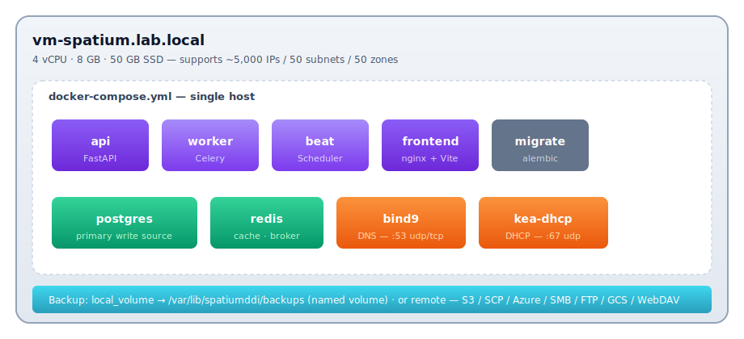
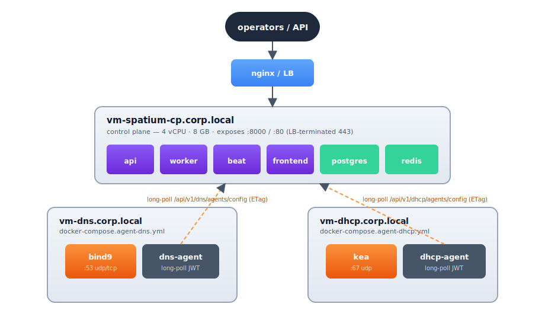
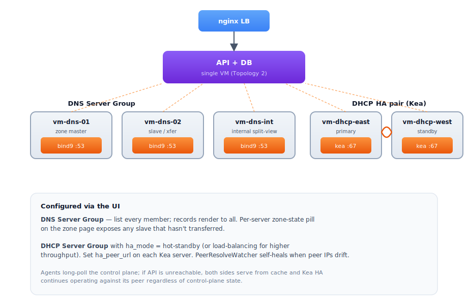
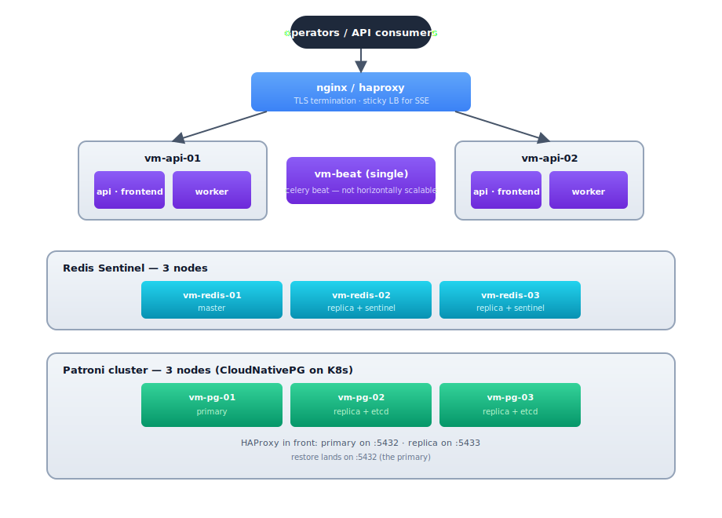
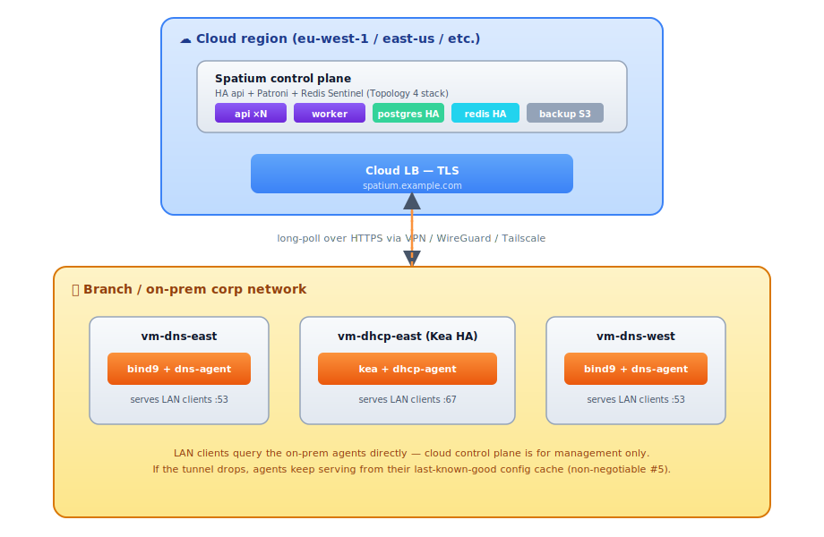
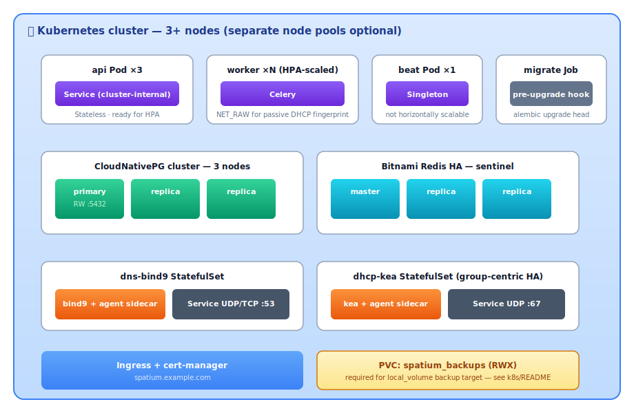

# Production Deployment Topologies

> SpatiumDDI is designed to scale from a single homelab VM all the way to a
> distributed multi-region deployment with the control plane in the cloud
> and DNS/DHCP agents running on-prem. This guide walks through five
> reference topologies and shows which knobs each one flexes.

For the per-platform install steps, see:

- [`DOCKER.md`](DOCKER.md) — Docker Compose deployment recipes
- [`../../k8s/README.md`](../../k8s/README.md) — Kubernetes manifests + Helm chart
- [`DNS_AGENT.md`](DNS_AGENT.md) — DNS-agent protocol details
- [`APPLIANCE.md`](APPLIANCE.md) — OS appliance image
- [`WINDOWS.md`](WINDOWS.md) — Windows Server-side checklist (WinRM / DnsAdmins / DHCP Users)

---

## What needs to scale, and how

| Concern | Where it lives | How it scales |
|---|---|---|
| **Control plane API** (`api`) | FastAPI process | Stateless — run N copies behind a load balancer |
| **Async work** (`worker`) | Celery worker process | N copies, sharded by queue (`ipam`, `dns`, `dhcp`, `default`) |
| **Scheduler** (`beat`) | Celery beat | Exactly **one** instance — not horizontally scalable. Run two with leader-election (`celery-beat-leader`) only if you need HA |
| **Frontend** (`frontend`) | nginx + static Vite build | Stateless — horizontally scalable, often co-located with the API behind the same LB |
| **PostgreSQL** | Stateful, primary write source | Patroni (bare-metal/VM) or CloudNativePG (K8s) for HA. Read replicas optional — SpatiumDDI doesn't currently route reads to replicas |
| **Redis** | Cache + Celery broker + factory-reset lock | Sentinel for HA; single-node fine until you need >1 worker host |
| **DNS agents** (BIND9 + sidecar) | Per DNS server | One agent per DNS server. 2-node HA via primary/secondary or split-horizon view |
| **DHCP agents** (Kea + sidecar) | Per DHCP server | One agent per DHCP server. Group-centric Kea HA across 2+ peers |
| **Backup destinations** | External (S3/SCP/Azure/SMB/FTP/GCS/WebDAV) | Out-of-band — operator's responsibility. SpatiumDDI just writes archives there |

The control plane's blast radius is roughly **the API container's writable
layer** (which is empty when scheduled targets push to a remote
destination). The agents survive control-plane outages because they
long-poll the `/config` endpoint with an ETag and cache the last-known-good
config locally — non-negotiable #5 in `CLAUDE.md`.

---

## Topology 1 — Single VM (dev / homelab)

Everything in one Docker Compose stack. This is the default
`make up` target and what most homelab installs run.

<p align="center">
  
</p>

**Pros:** simplest to run, fastest to bring up, single backup unit.
**Cons:** every service shares one host. A noisy neighbor (e.g. a DHCP
storm filling Kea's lease store) can degrade the API. No HA.

**Sizing:** 4 vCPU / 8 GB / 50 GB SSD comfortably handles up to
~5,000 IP addresses across ~50 subnets, ~50 DNS zones, and a
modest DHCP scope set. Past that, split off the agents (Topology 2).

---

## Topology 2 — Control plane + separate DNS/DHCP appliances

The shape most production deployments reach for first. Control plane
on its own VM; DNS and DHCP agents on dedicated, network-edge
machines. Agents long-poll the control plane's API.

<p align="center">
  
</p>

**What this gets you:**

- Control plane outages don't take DNS/DHCP down. The agents serve
  zones / leases from the local cache until the API is reachable
  again.
- DNS and DHCP can sit at the network edge with their own firewall
  rules, while the API can be inside a corp network behind LDAP /
  OIDC.
- Each appliance can be sized for its workload — DNS query volume vs
  DHCP lease churn typically don't peak at the same time of day.

**The two compose files:**

```bash
# On vm-dns (BIND9 — pick `agent-dns-powerdns.yml` instead for PowerDNS):
export SPATIUM_API_URL=https://spatium-cp.corp.local
export SPATIUM_AGENT_KEY=<paste-from-Settings→Agent Keys>
export DNS_HOSTNAME=vm-dns.corp.local
docker compose -f docker-compose.agent-dns-bind9.yml up -d

# On vm-dhcp:
export SPATIUM_API_URL=https://spatium-cp.corp.local
export SPATIUM_AGENT_KEY=<paste-from-Settings→Agent Keys>
export DHCP_HOSTNAME=vm-dhcp.corp.local
docker compose -f docker-compose.agent-dhcp.yml up -d
```

The agent registers with the control plane on first boot, exchanges
its PSK for a rotating JWT, then long-polls forever. See
[`DNS_AGENT.md`](DNS_AGENT.md) for the protocol.

---

## Topology 3 — DNS + DHCP HA pairs

Production-grade availability. Multiple DNS servers in a server group
(primary + secondary, or split-horizon views), Kea DHCP HA across
two peers. Each DNS or DHCP host is its own VM.

<p align="center">
  
</p>

Configured via the UI:

- **DNS Server Group** — list `vm-dns-01` and `vm-dns-02` as members of one
  group. Records render to both. SpatiumDDI watches per-server zone
  serials so you can spot a slave that hasn't transferred (zone-state pill
  on the zone page).
- **DHCP Server Group** with HA mode = `hot-standby` (or `load-balancing`
  for higher throughput). Set `ha_peer_url` on each Kea server to the
  other peer's reachable URL. The `2026.04.21-2` release shipped the
  three-wave HA story including peer-IP self-healing — DNS changes that
  rename a peer no longer break the HA pair.

The DNS and DHCP agents continue to long-poll the control plane; if
the API is unreachable, both sides serve from cache and Kea HA
continues operating against its peer regardless of control-plane state.

---

## Topology 4 — HA control plane (Patroni + Redis Sentinel)

Removes the control plane as a single point of failure. Two or more
API hosts behind a load balancer; PostgreSQL via Patroni (3 nodes is
the standard quorum); Redis via Sentinel. Beat stays single-instance
(see the table at the top — it's not horizontally scalable without
leader-election).

<p align="center">
  
</p>

DNS / DHCP agents per Topology 2 / 3 above, pointing at the LB URL.

**What's in the repo for this:**

- `k8s/ha/cnpg-cluster.yaml` — CloudNativePG manifest (K8s analogue of
  Patroni). Three-node primary + 2 replicas with auto-failover.
- `k8s/ha/redis-sentinel.yaml` — Redis Sentinel manifest.
- `k8s/ha/patroni-compose.yml` — Patroni reference for Docker Compose
  (use this if you're not on K8s yet but want a real HA database).
- `charts/spatiumddi` — umbrella Helm chart that pulls in the above
  via subcharts when `postgresHa.enabled=true` /
  `redisHa.enabled=true`.

The API is stateless — no in-memory session state — so a request
hitting either api host gets the same answer. Sticky LB only matters
for the SSE streams (chat orchestrator, scheduled-target-archives
list); the LB just needs to keep the connection on the same backend
once it's open.

**Beat HA caveat.** Celery beat is intentionally single-instance.
Running two beats without leader-election double-fires every
scheduled task. If you need beat HA, use `celery-beat-leader` (Redis-
based leader election) and configure each beat instance with the
same lock key. We don't ship that today — for most installs the
"recreate beat from a healthy backup" recovery path is fine.

---

## Topology 5 — Hybrid cloud: control plane in cloud, agents on-prem

Control plane runs in your cloud account (AWS / Azure / GCP / Hetzner /
DigitalOcean / Vultr — any provider). DNS and DHCP agents stay
on-prem because they're network-path dependencies — DNS recursion has
to terminate close to the queriers, DHCP has to be on the same broadcast
domain as its clients.

<p align="center">
  
</p>

**Why this works:**

1. The control plane's only outbound dependency is the database. Cloud
   provides better postgres HA than most on-prem racks.
2. The agents don't need a persistent control-plane connection. They
   long-poll over HTTPS; the connection can drop for hours and they
   keep serving from cache.
3. Backup destinations don't have to be in the same region. A cloud
   control plane can write nightly archives to an on-prem SCP target
   (or vice versa). See the SCP / S3 / Azure / SMB / FTP / GCS / WebDAV
   driver matrix in `docs/features/SYSTEM_ADMIN.md` §2.9.

**Caveats:**

- Latency. The web UI and `/api/v1/*` round-trips go cloud-to-corp.
  For a US team operating an EU control plane that's 80–150 ms per
  request — workable but noticeably slower than local. Pick a region
  near your operators.
- TLS certificate management for `spatium.example.com` belongs to the
  cloud-side LB. Use ACME (the embedded ACME client lands in Phase 4) or
  bring-your-own.
- Audit-forward / SMTP / webhook events fire from the cloud-side
  control plane. Make sure your network policy lets them out — most
  setups don't have to think about this.

**Cloud variants of each component:**

| Component | AWS | Azure | GCP | Comment |
|---|---|---|---|---|
| API + worker + beat | EC2 + ALB / ECS Fargate / EKS | VM Scale Set + App Gateway / AKS | GCE + L7 LB / GKE | Stateless; treat as cattle |
| Postgres | RDS (Multi-AZ) | Azure Database for PostgreSQL | Cloud SQL | All three honor `postgresql+asyncpg://` URLs |
| Redis | ElastiCache (cluster mode) | Azure Cache for Redis | Memorystore | Sentinel not required when the managed service does failover |
| Backup destination | S3 native | Azure Blob native | GCS native | All three driver kinds ship in the registry |
| Frontend (static) | CloudFront + S3 | Azure CDN + Blob | Cloud CDN + GCS | Or just serve from the same LB |

---

## Topology 6 — Kubernetes (single chart, multi-node)

The Kubernetes flavour of Topology 4. The umbrella Helm chart
(`charts/spatiumddi`) ships every component — api / worker / beat /
frontend / migrate / Postgres + Redis subcharts (or external
endpoints) / optional DNS+DHCP agent StatefulSets.

<p align="center">
  
</p>

The chart's relevant values:

```yaml
postgresHa.enabled: true        # uses CloudNativePG subchart
redisHa.enabled: true           # uses Bitnami redis subchart with sentinel
api.replicas: 3
worker.replicas: 4
worker.netRawCapability: true   # for passive DHCP fingerprinting
beat.enabled: true              # exactly one
dnsAgents.enabled: true         # spawns the bind9 StatefulSet
dhcpAgents.enabled: true        # spawns the kea StatefulSet (group-centric HA)
```

See [`../../k8s/README.md`](../../k8s/README.md) for the Helm-vs-raw-manifest
walkthrough, the RWX PVC overlay needed for `local_volume` backup
targets, and the upgrade-flow recipe.

---

## Picking a topology

| You have... | Start with |
|---|---|
| A single homelab box, 3 people max using it | Topology 1 |
| One DC, network-edge appliances expected | Topology 2 |
| One DC, downtime-sensitive DNS or DHCP | Topology 3 |
| Multi-DC or cloud-first ops team | Topology 4 |
| Branch offices feeding back to a HQ control plane | Topology 5 |
| Anything K8s-native | Topology 6 |

You can move between topologies without re-installing. Going from
Topology 1 → 2 → 3 → 4 is purely additive: new VMs join the existing
control plane via the agent-key bootstrap. The database doesn't
move; you just point more agents at the same API URL and add their
`agent_key` rows in **Settings → Agents**.

---

## Backup + factory-reset across topologies

Backup and factory-reset (issues #117 + #116) work the same
regardless of topology — they hit the API endpoints, which are
stateless. A few shape notes:

- **`local_volume` backup target** in Topology 1 is fine on the
  single host. In Topology 2+, it lives on the control-plane VM and
  isn't shared with anything; switch to S3 / SCP / Azure / GCS /
  SMB / FTP / WebDAV for distributed installs.
- **Restore** runs via `pg_restore` against the live Postgres. In
  Topology 4+ point this at the **primary** (Patroni HAProxy port
  5432, not the read-replica port). The api containers' SQLAlchemy
  pool gets disposed during restore, so transient 503s during the
  restore window are expected — see the `pool_pre_ping=True` +
  transient-DB handler in `app/db.py`.
- **Cross-install rewrap on restore** (issue #117 Phase 2) means
  cross-topology restores don't need the recovered `SECRET_KEY`
  copied to the destination's env. Restore "just works" between
  Topology 1 ↔ 4 even if their `SECRET_KEY` env vars differ.
- **Factory reset** (issue #116) is global per-install; it doesn't
  touch agents. Each agent re-bootstraps from its PSK after a
  reset that wiped the agent-key rows.

---

## What's NOT supported (yet)

- **Active-active control plane across regions.** The schema isn't
  partitioned for it. One Patroni cluster per install today.
- **Multi-tenant control plane.** Coming as Phase 5 per the
  CLAUDE.md roadmap. Today, "tenants" = separate installs.
- **Read replicas as query routes.** All reads currently go to the
  primary. The Patroni cluster's replicas exist for failover, not
  read scaling.
- **PostgreSQL on AWS Aurora-Postgres compatibility.** Should work
  in theory (Aurora speaks the same wire protocol) but isn't on
  the supported matrix. The `pool_pre_ping` semantics interact
  poorly with Aurora's 30s connection-recycle. File an issue if
  you've validated it.
